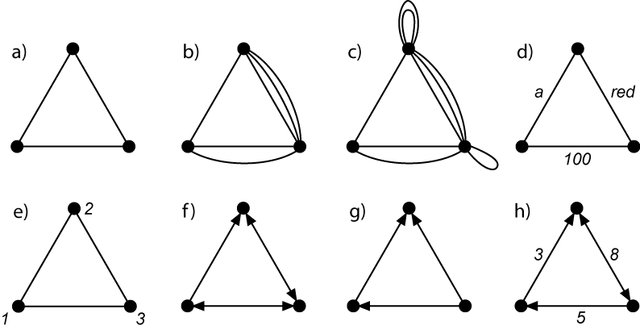

# Discrete Mathematics

## Graph theory

A graph is a mathematical model that represents the relationships between objects into a set.

There are several types of graphs. Some of them are the multigraph, the pseudograph, the ponderated graph, the directed graph, and the directed multigraph.

*Graphs: a) simple graph; b) multigraph; c) pseudograph; d) labelled graph (edges); e) labelled graph (vertices); f) directed graph; g) oriented graph; h) network. (Weisstein, 1999).*

Some basics concepts

* The **degree of a vertex** $\delta(v)$ corresponds to the number of edges that fall upon that vertex. It is notable that $ \sum \delta(v) = 2 |E|$, where $E$ is the number of edges in the system.
* An **eulerian path** runs the entire graph without repeating a connection. The graph must not have more than two vertices with an odd degree.
* An **eulerian cycle** runs the entire graph without repeating a connection. An eulerian cycle is possible only when all the vertices of the graph are even degrees.
* The **hamiltonian paths and cycles** visit all nodes once, regardless of the path we use.
* The **adjacency matrix** represents the connections between the nodes of a system. It is useful to handle large models.
* The **incidence matrix** is made to represent the connections between the nodes of a system through its edges. Each edge must have a unique id in the model.

### Tree theory

Trees are a type of graph that represents a data structure. Trees have numerous applications in machine learning, computer sciences, and programming.

There are several types of trees:

* **Free** if it is not clear which is the primary node or node within this tree's root.
* **Root** if there is a clear structure of the nodes. They all start from the same root node.
* **Spanning** when the connection between the nodes has an associated resource.

## Algorithms

**Prim's algorithm** finds the minimum cost of visit all nodes in a spanning tree. The algorithm works as follows.

* We randomly choose a node.
* We iteratively connect new nodes, choosing the edges with the lowest cost associated.
* We care of no form internal cycles.
* The iterations stop when we have connected all nodes with $ n-1 $ edges, where $ n $ is the vertices' total number.

**Dijkstra's algorithm** is designed to find the optimal path between two nodes. The algorithm follows these steps:

* To assign infinity value to each node that has not been visited yet.
* To record all nodes that have been visited.
* To calculate the distance to each node that has not been visited.
* If the newly calculated distance is shorter than before, then it is replaced.
* The algorithm stops when we connect the final node.

**Kruskal's algorithm** seeks the minimum spanning tree. The algorithm is designed to start selecting the edge with the lowest associated value. Then, we select the lowest value edges in each iteration.

**Fleury's algorithm** aims to find an eulerian path. The algorithm is performed as follows.

* We calculate the degree of the graph in order to verify the existence of a solution.
* We generate a closed path.
* We generate a new closed path among the edges that have not been visited yet.
* We replace each new circuit in the initial until we visit all edges.

The **maximum flux algorithm**. The algorithm is executed following a series of steps.

* We obtain trajectories that seek maximum flux from an initial and final node.
* The thinner edge determines the flux in each path.
* We update the graph with the remaining capacities of each edge.
* We seek a new path and repeat the process until we have occupied all remaining capacities.
