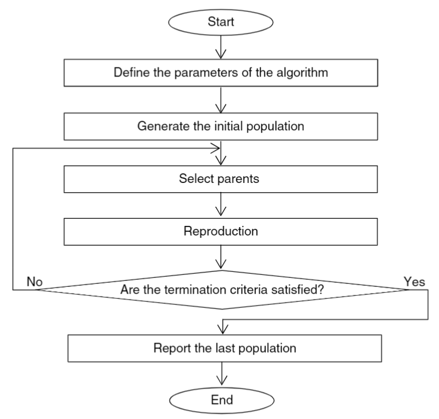
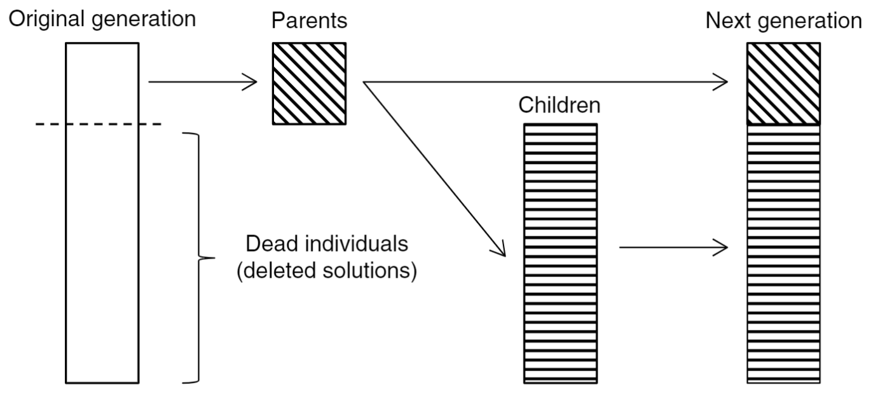
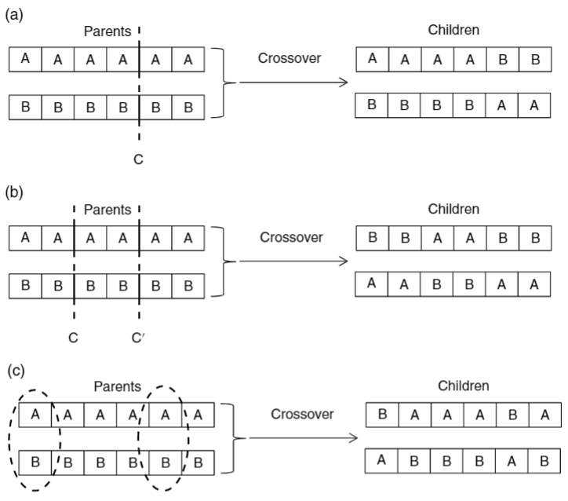

# Mathematical foundations for artificial intelligence

Artificial intelligence has gained attention in the last decade. In effect, many practical applications of AI make our daily lives easier. Mathematics plays a crucial role as it builds the foundation for programming for these two streams. The following notes present the mathematical foundations for artificial intelligence, including the support vector machine method (SVMs) and the genetic algorithm (GA).

## 1. Support Vector Machine

Support vector machines (SVMs) are supervised learning methods used for classification, regression, and outliers detection.

The advantages of support vector machines are:

- SVMs are effective in high-dimensional spaces.
- SVMs are memory-efficient since they use a subset of training points in the decision function (called support vectors).
- SVMs are versatile because different Kernel functions can be specified for the decision function.

The disadvantages of support vector machines include:

* If the number of features is much greater than the number of samples, avoiding over-fitting in choosing Kernel functions and regularization is crucial.
* SVMs do not directly provide probability estimates. These are calculated using an expensive five-fold cross-validation.

## 2. Genetic algorithm

The genetic algorithm is an optimization technique based on the Darwinian principle of survival of the fittest. Consequently, the fittest individuals are more able to generate offspring. A random mutation process is simulated to modify some genes of the children. The resulting generation is a mixture of the parents and children population and is expected to represent an improvement in that species.

From a mathematical point of view, each chromosome $X_{k}$ is made up of a series of $N$ genes or decision variables. Each gene combination represents a possible solution to the optimization problem.

$$
X = (x_{1}, \ldots, x_{k},\ldots, x_{N})

$$

We define the population as a group of $M$ chromosomes. Then, the selection and mutation process is performed until a termination criterion is achieved. The algorithm flowchart is shown in the following figure.

*The flowchart of the genetic algorithm. Taken from Bozorg‐Haddad, 2017.*

In the following, we describe each stage of the GA flowchart in detail.

1. Generating an initial population

An initial guess or population is generated randomly to start the iterations. Here, some of the initially generated possible solutions are selected as parents to produce a new generation in the next stage.

2. Selection of Parents to Create a New Generation

Once an initial population is generated, a subset of individuals is chosen for reproduction. The selected chromosomes are the parents of the next generation and constitute the parent population. There are several approaches to perform a selection process, such as proportionate selection, ranking selection, and tournament selection.

Here we present only the proportionate selection. The probability $P_{k}$ of been selected is proportional to the fitness value $F_{k}$ for each chromosome $k$.

$$
P_{k} = \frac{F(X_{k})}{\sum_{j=1}^{M} F(X_{j})}

$$

3. Reproduction

The genetic algorithm must generate new solutions in order to improve the objective function. Producing a new generation starts by creating children by crossover and then modifies its genes by mutation. Therefore, the next generation is a mixture of the parent population and the children population. The proportion of parents to offspring is a user‐defined parameter. The point is shown in the figure below.

*The process of constituting a new generation from the previous generation. Taken from Bozorg‐Haddad, 2017.*

Some parents are selected once more with a crossover probability  $P_{C}$ in the crossover stage. Among the selected solutions, some are chosen pairwise with a uniform distribution to produce offspring. Not all parents necessarily generate children. There are different techniques to make the crossover. Some of them are illustrated in the following figure.

*Different approaches of crossover: (a) one‐point crossover, (b) two‐point crossover, and (c) uniform crossover. Taken from Bozorg‐Haddad, 2017.*

Mutation introduces new genetic material to a population. The mutation operator randomly replaces some genes of an offspring. In other words, one or more decision variables of a new chromosome are substituted with random values while keeping others unaffected.

The mutation can be uniform or nonuniform. The uniform approach generates $x^{'}_{j}$

Uniform mutation generates a $X = (x_{1}, \ldots, x^{'}_{k},\ldots, x_{N})$, where $x^{'}_{j}$ is a random value bounded by the lowest and the highest value of the other genes. In contrast, the nonuniform mutation is used when high precision is required. The mutated gene's value $x^{'}_{j}$is calculated.

$$
x^{'}_{j} = Rand(x_{j} - d , x_{j} + d)

$$

Where

$$
d = d_{0} \frac{T-t}{T}

$$

Here, $d_0$ is the initial value of $d$, t is the current iteration, and T is the maximum number of iterations.

1. Termination criteria

A **termination criterion** is needed to stop the iterative process. Selecting a good termination criterion is crucial to reach a correct convergence of the algorithm. The number of iterations, the amount of improvement of the objective function between consecutive iterations, and the runtime are standard termination criteria for the genetic algorithm.

## References

- https://scikit-learn.org/stable/auto_examples/svm/plot_separating_hyperplane.html#sphx-glr-auto-examples-svm-plot-separating-hyperplane-py
- https://scikit-learn.org/stable/modules/svm.html#svm
- Bozorg‐Haddad, O., Solgi, M. and Loáiciga, H.A. (2017). Genetic Algorithm. In Meta‐Heuristic and Evolutionary Algorithms for Engineering Optimization (eds O. Bozorg‐Haddad, M. Solgi and H.A. Loáiciga). [https://doi.org/10.1002/9781119387053.ch4](https://doi.org/10.1002/9781119387053.ch4)
